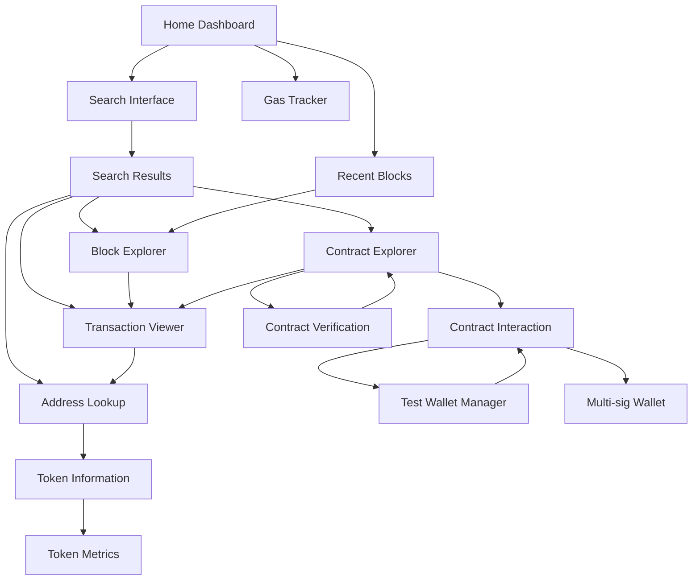

# WarpScan - Terminal-Based Ethereum Explorer

## 1. Product Overview
WarpScan is a comprehensive terminal-based Ethereum blockchain explorer that brings all the functionality of Etherscan to the command line. Built for developers and power users who prefer terminal interfaces, it provides real-time blockchain data, contract analysis, and transaction monitoring in an efficient TUI environment.

The product solves the need for quick blockchain data access without leaving the terminal, targeting developers, blockchain analysts, and crypto enthusiasts who value speed and efficiency over graphical interfaces.

## 2. Core Features

### 2.1 User Roles
Since this is a terminal application focused on blockchain data access, user roles are not necessary. All users have the same access to public blockchain data.

### 2.2 Feature Module
Our WarpScan requirements consist of the following main pages:
1. **Home Dashboard**: network status, recent blocks, gas tracker, search interface
2. **Block Explorer**: block details, transaction list, block navigation
3. **Transaction Viewer**: transaction details, logs, trace data, gas analysis
4. **Address Lookup**: address overview, transaction history, token balances, contract verification
5. **Contract Explorer**: contract source code, ABI viewer, read/write functions, events, verification system
6. **Contract Interaction**: function calls, transaction simulation, test wallet management
7. **Token Information**: token details, holders analysis, transfers, market data
8. **Contract Verification**: source code upload, compilation verification, verification status
9. **Test Wallet Manager**: wallet generation, private key management, transaction signing
10. **Gas Tracker**: current gas prices, historical trends, gas estimation tools
11. **Search Results**: unified search results with filtering and sorting
12. **Multi-sig Wallet**: multi-signature wallet creation and management

### 2.3 Page Details

| Page Name | Module Name | Feature description |
|-----------|-------------|---------------------|
| Home Dashboard | Network Status | Display current block number, network hash rate, gas prices, and network health indicators |
| Home Dashboard | Recent Blocks | Show latest 10 blocks with timestamps, gas usage, and transaction counts |
| Home Dashboard | Search Interface | Universal search bar supporting addresses, transactions, blocks, and contracts |
| Home Dashboard | Gas Tracker | Real-time gas price recommendations (slow, standard, fast) with historical chart |
| Block Explorer | Block Details | Show block hash, timestamp, miner, gas limit/used, difficulty, and block rewards |
| Block Explorer | Transaction List | Display all transactions in block with hash, from/to addresses, value, and gas |
| Block Explorer | Block Navigation | Navigate between blocks using previous/next controls and direct block number input |
| Transaction Viewer | Transaction Details | Show hash, status, block confirmation, from/to addresses, value, gas price/limit/used |
| Transaction Viewer | Logs & Events | Display transaction logs, decoded events, and internal transactions |
| Transaction Viewer | Trace Data | Show execution trace, state changes, and call stack for debugging |
| Address Lookup | Address Overview | Display address type, balance, transaction count, and creation details |
| Address Lookup | Transaction History | Paginated list of all transactions (sent/received) with filtering options |
| Address Lookup | Token Balances | Show all ERC-20/ERC-721 token holdings with current values |
| Address Lookup | Contract Verification | Display contract source code, compiler version, and verification status |
| Contract Explorer | Source Code | Show verified contract source code with syntax highlighting and line numbers |
| Contract Explorer | ABI Viewer | Display contract ABI in readable format with function signatures and parameter types |
| Contract Explorer | Read Functions | Interface to call view/pure contract functions and display results in real-time |
| Contract Explorer | Write Functions | Interface to prepare transaction calls for state-changing functions with gas estimation |
| Contract Explorer | Events & Logs | Show contract events with filtering by event type, parameters, and block range |
| Contract Explorer | Verification Status | Display contract verification status, compiler version, and optimization settings |
| Contract Interaction | Function Interface | Interactive form for calling contract functions with parameter validation |
| Contract Interaction | Transaction Simulation | Simulate transactions before execution with gas cost and state change preview |
| Contract Interaction | Batch Operations | Execute multiple contract calls in a single transaction |
| Contract Interaction | Event Monitoring | Real-time monitoring of contract events with custom filters |
| Token Information | Token Details | Display name, symbol, decimals, total supply, contract address, and token type |
| Token Information | Holders Analysis | Show top token holders with percentages, distribution charts, and holder count |
| Token Information | Transfer History | Recent token transfers with from/to addresses, amounts, and transaction links |
| Token Information | Token Metrics | Price data, market cap, trading volume, and holder statistics |
| Contract Verification | Source Upload | Upload contract source code files with folder structure support |
| Contract Verification | Compilation | Compile contracts with specified compiler version and optimization settings |
| Contract Verification | Verification Process | Step-by-step verification with bytecode comparison and status tracking |
| Contract Verification | Verification Database | Browse verified contracts with search and filtering capabilities |
| Test Wallet Manager | Wallet Generation | Generate new test wallets with mnemonic phrases and private keys |
| Test Wallet Manager | Wallet Import | Import existing wallets using private keys or mnemonic phrases |
| Test Wallet Manager | Balance Management | View wallet balances for ETH and tokens with refresh capabilities |
| Test Wallet Manager | Transaction Signing | Sign and broadcast transactions using managed test wallets |
| Test Wallet Manager | Wallet Security | Secure storage of private keys with encryption and backup options |
| Multi-sig Wallet | Wallet Creation | Create multi-signature wallets with configurable threshold and signers |
| Multi-sig Wallet | Transaction Proposals | Create and manage transaction proposals requiring multiple signatures |
| Multi-sig Wallet | Signature Collection | Collect signatures from multiple parties with approval tracking |
| Gas Tracker | Current Prices | Real-time gas prices for different transaction speeds |
| Gas Tracker | Historical Trends | Gas price charts over different time periods (1h, 24h, 7d) |
| Gas Tracker | Gas Estimation | Tool to estimate gas costs for different transaction types |
| Search Results | Unified Results | Display search results categorized by type (address, transaction, block, contract) |
| Search Results | Filtering & Sorting | Options to filter results by type, date, value, and sort by relevance |

## 3. Core Process

**Main User Flow:**
1. User launches WarpScan terminal application
2. Home dashboard displays with network overview and search interface
3. User can navigate using keyboard shortcuts or search for specific blockchain data
4. Search results are categorized and displayed with navigation options
5. User can drill down into specific blocks, transactions, addresses, or contracts
6. Each detail view provides comprehensive information with options to explore related data
7. User can interact with contracts using generated test wallets or verify new contracts
8. User can bookmark frequently accessed addresses/contracts for quick access

**Contract Interaction Flow:**
1. User navigates to contract explorer or searches for a contract
2. User can view contract source code, ABI, and verification status
3. User generates or imports a test wallet for interaction
4. User calls read functions to query contract state
5. User prepares write transactions with gas estimation and simulation
6. User signs and broadcasts transactions using test wallet
7. User monitors transaction status and contract events

**Contract Verification Flow:**
1. User navigates to contract verification section
2. User uploads contract source code files
3. User specifies compiler version and optimization settings
4. System compiles and compares bytecode with deployed contract
5. Verification status is updated and contract becomes publicly verified

## 4. User Interface Design

### 4.1 Design Style
- **Primary Colors**: Terminal green (#00FF00) for highlights, white (#FFFFFF) for text
- **Secondary Colors**: Yellow (#FFFF00) for warnings, red (#FF0000) for errors, blue (#0080FF) for links
- **Layout Style**: Split-pane design with navigation sidebar and main content area
- **Typography**: Monospace fonts (default terminal font) with consistent sizing
- **Interactive Elements**: Highlighted selections, keyboard shortcuts displayed, status indicators
- **Visual Hierarchy**: Box borders, indentation, and color coding for data organization

### 4.2 Page Design Overview

| Page Name | Module Name | UI Elements |
|-----------|-------------|-------------|
| Home Dashboard | Network Status | Top status bar with network info, color-coded health indicators |
| Home Dashboard | Search Interface | Centered search box with placeholder text and search suggestions |
| Home Dashboard | Recent Blocks | Table layout with alternating row colors, sortable columns |
| Block Explorer | Block Details | Key-value pairs in bordered sections, navigation breadcrumbs |
| Transaction Viewer | Transaction Details | Hierarchical data display with expandable sections |
| Address Lookup | Address Overview | Summary cards with icons, tabbed interface for different data types |
| Contract Explorer | Source Code | Syntax-highlighted code viewer with line numbers and search |
| Gas Tracker | Price Display | Real-time updating numbers with trend indicators and mini-charts |

### 4.3 Responsiveness
The application is designed for terminal environments with minimum 80x24 character display. It adapts to larger terminal sizes by expanding content areas and showing more data per screen. Keyboard navigation is optimized for efficiency with vim-like shortcuts and tab-based navigation between interface elements.