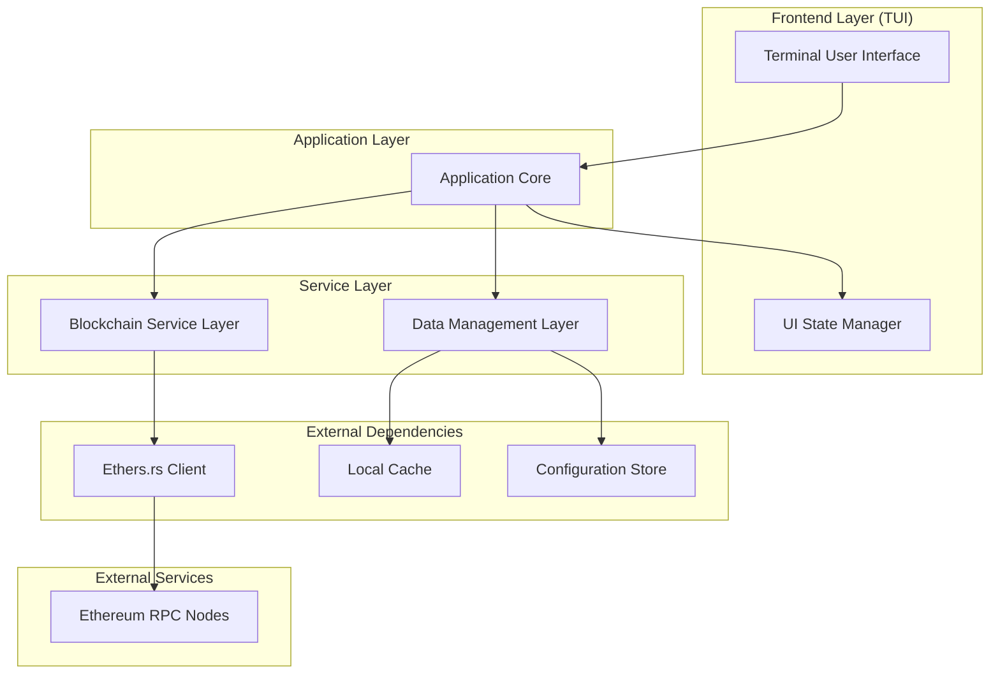
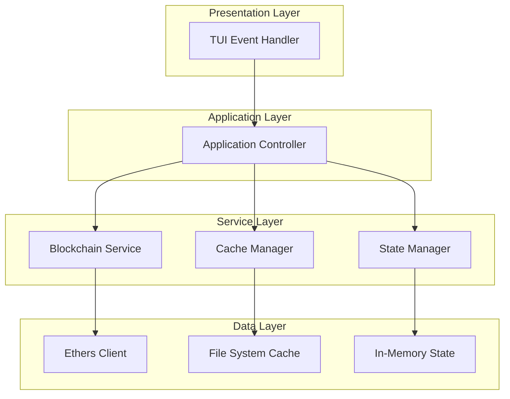
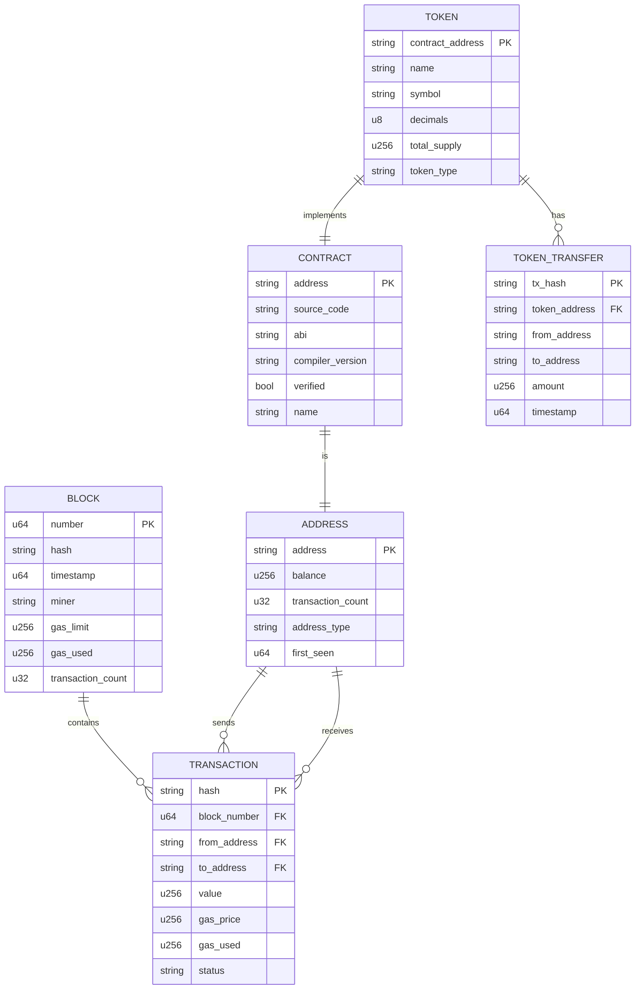

# WarpScan - Technical Architecture Document

## 1. Architecture Design



## 2. Technology Description

- **Frontend**: Rust + ratatui@0.28 + crossterm@0.27
- **Blockchain Integration**: ethers@2.0
- **Data Storage**: Local file-based cache + in-memory state
- **Configuration**: TOML-based configuration files

## 3. Route Definitions

| Route/Screen | Purpose |
|--------------|----------|
| /home | Main dashboard with network overview and search interface |
| /block/:number | Block explorer showing detailed block information |
| /tx/:hash | Transaction viewer with comprehensive transaction details |
| /address/:address | Address lookup showing balance, transactions, and contract info |
| /contract/:address | Contract explorer with source code and ABI interface |
| /contract/:address/interact | Contract interaction interface with function calls and simulation |
| /contract/verify | Contract verification system for uploading and verifying source code |
| /token/:address | Token information page with holders and transfer data |
| /wallet | Test wallet manager for generating and managing test wallets |
| /multisig | Multi-signature wallet creation and management interface |
| /gas | Gas tracker with current prices and historical trends |
| /search | Search results page with filtering and categorization |

## 4. API Definitions

### 4.1 Core API

**Blockchain Data Retrieval**

```rust
// Block operations
get_block_by_number(block_number: u64) -> Result<Block, Error>
get_latest_block() -> Result<Block, Error>
get_block_transactions(block_number: u64) -> Result<Vec<Transaction>, Error>

// Transaction operations
get_transaction_by_hash(tx_hash: String) -> Result<Transaction, Error>
get_transaction_receipt(tx_hash: String) -> Result<TransactionReceipt, Error>
get_transaction_trace(tx_hash: String) -> Result<TransactionTrace, Error>

// Address operations
get_address_balance(address: String) -> Result<U256, Error>
get_address_transactions(address: String, page: u32) -> Result<Vec<Transaction>, Error>
get_address_token_balances(address: String) -> Result<Vec<TokenBalance>, Error>

// Contract operations
get_contract_source(address: String) -> Result<ContractSource, Error>
get_contract_abi(address: String) -> Result<Abi, Error>
call_contract_function(address: String, function: String, params: Vec<String>) -> Result<String, Error>
get_contract_events(address: String, from_block: u64, to_block: u64) -> Result<Vec<Event>, Error>
get_contract_verification_status(address: String) -> Result<VerificationStatus, Error>

// Contract interaction
simulate_transaction(from: String, to: String, data: String, value: U256) -> Result<SimulationResult, Error>
estimate_gas(from: String, to: String, data: String, value: U256) -> Result<U256, Error>
send_transaction(signed_tx: SignedTransaction) -> Result<String, Error>
monitor_contract_events(address: String, event_filter: EventFilter) -> Result<EventStream, Error>

// Contract verification
verify_contract(address: String, source_code: String, compiler_version: String, optimization: bool) -> Result<VerificationResult, Error>
compile_contract(source_code: String, compiler_version: String, optimization: bool) -> Result<CompilationResult, Error>
get_verified_contracts(page: u32, limit: u32) -> Result<Vec<VerifiedContract>, Error>

// Wallet management
generate_wallet() -> Result<Wallet, Error>
import_wallet(private_key: String) -> Result<Wallet, Error>
import_wallet_from_mnemonic(mnemonic: String) -> Result<Wallet, Error>
get_wallet_balance(address: String) -> Result<WalletBalance, Error>
sign_transaction(wallet: &Wallet, transaction: Transaction) -> Result<SignedTransaction, Error>

// Multi-signature operations
create_multisig_wallet(owners: Vec<String>, threshold: u32) -> Result<MultisigWallet, Error>
propose_multisig_transaction(wallet_address: String, to: String, value: U256, data: String) -> Result<ProposalId, Error>
sign_multisig_proposal(wallet_address: String, proposal_id: ProposalId, signature: String) -> Result<(), Error>
execute_multisig_transaction(wallet_address: String, proposal_id: ProposalId) -> Result<String, Error>

// Token operations
get_token_holders(contract_address: String, page: u32) -> Result<Vec<TokenHolder>, Error>
get_token_transfers(contract_address: String, from_block: u64, to_block: u64) -> Result<Vec<TokenTransfer>, Error>
get_token_metrics(contract_address: String) -> Result<TokenMetrics, Error>

// Gas tracking
get_gas_prices() -> Result<GasPrices, Error>
get_gas_history(period: TimePeriod) -> Result<Vec<GasPrice>, Error>
```

**Data Types**

```rust
#[derive(Debug, Clone)]
pub struct Block {
    pub number: u64,
    pub hash: String,
    pub timestamp: u64,
    pub miner: String,
    pub gas_limit: U256,
    pub gas_used: U256,
    pub transaction_count: u32,
    pub difficulty: U256,
}

#[derive(Debug, Clone)]
pub struct Transaction {
    pub hash: String,
    pub block_number: u64,
    pub from: String,
    pub to: Option<String>,
    pub value: U256,
    pub gas_price: U256,
    pub gas_limit: U256,
    pub gas_used: Option<U256>,
    pub status: TransactionStatus,
}

#[derive(Debug, Clone)]
pub struct TokenBalance {
    pub contract_address: String,
    pub symbol: String,
    pub name: String,
    pub balance: U256,
    pub decimals: u8,
}

#[derive(Debug, Clone)]
pub struct GasPrices {
    pub slow: U256,
    pub standard: U256,
    pub fast: U256,
    pub timestamp: u64,
}

#[derive(Debug, Clone)]
pub struct Wallet {
    pub address: String,
    pub private_key: String,
    pub mnemonic: Option<String>,
    pub created_at: u64,
}

#[derive(Debug, Clone)]
pub struct WalletBalance {
    pub eth_balance: U256,
    pub token_balances: Vec<TokenBalance>,
}

#[derive(Debug, Clone)]
pub struct MultisigWallet {
    pub address: String,
    pub owners: Vec<String>,
    pub threshold: u32,
    pub created_at: u64,
}

#[derive(Debug, Clone)]
pub struct VerificationStatus {
    pub is_verified: bool,
    pub compiler_version: Option<String>,
    pub optimization_enabled: Option<bool>,
    pub verified_at: Option<u64>,
}

#[derive(Debug, Clone)]
pub struct SimulationResult {
    pub success: bool,
    pub gas_used: U256,
    pub return_data: String,
    pub state_changes: Vec<StateChange>,
    pub error_message: Option<String>,
}

#[derive(Debug, Clone)]
pub struct TokenHolder {
    pub address: String,
    pub balance: U256,
    pub percentage: f64,
}

#[derive(Debug, Clone)]
pub struct TokenMetrics {
    pub price_usd: Option<f64>,
    pub market_cap: Option<f64>,
    pub volume_24h: Option<f64>,
    pub holder_count: u32,
    pub transfer_count_24h: u32,
}

#[derive(Debug, Clone)]
pub struct Event {
    pub address: String,
    pub topics: Vec<String>,
    pub data: String,
    pub block_number: u64,
    pub transaction_hash: String,
    pub log_index: u32,
}
```

## 5. Server Architecture Diagram



## 6. Data Model

### 6.1 Data Model Definition



### 6.2 Data Definition Language

**Cache Storage Structure**

```rust
// Local cache directory structure
~/.warpscan/
├── config.toml
├── cache/
│   ├── blocks/
│   │   └── {block_number}.json
│   ├── transactions/
│   │   └── {tx_hash}.json
│   ├── addresses/
│   │   └── {address}.json
│   ├── contracts/
│   │   └── {address}.json
│   └── tokens/
│       └── {contract_address}.json
└── logs/
    └── warpscan.log
```

**Configuration Schema**

```toml
# ~/.warpscan/config.toml
[network]
rpc_url = "https://mainnet.infura.io/v3/YOUR_PROJECT_ID"
chain_id = 1
timeout_seconds = 30

[cache]
enabled = true
max_size_mb = 100
ttl_seconds = 3600

[ui]
theme = "default"
refresh_interval_ms = 5000
max_results_per_page = 20

[gas]
update_interval_seconds = 15
history_days = 7
```

**Initial Data Structures**

```rust
// Application state initialization
pub struct AppState {
    pub current_screen: Screen,
    pub search_query: String,
    pub selected_network: Network,
    pub cache: Arc<Mutex<Cache>>,
    pub blockchain_client: Arc<EthersClient>,
    pub ui_state: UiState,
}

// Cache implementation
pub struct Cache {
    pub blocks: LruCache<u64, Block>,
    pub transactions: LruCache<String, Transaction>,
    pub addresses: LruCache<String, AddressInfo>,
    pub contracts: LruCache<String, ContractInfo>,
}

// Network configuration
pub enum Network {
    Mainnet,
    Goerli,
    Sepolia,
    Custom(String),
}
```